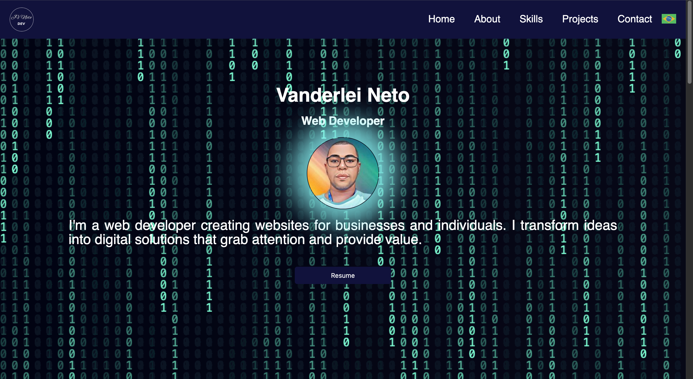

<h1 align="center">Vanderlei Neto</h1>

  This website was developed to be my personal portfolio.  

  <a href="#-technologies">Technologies</a>&nbsp;&nbsp;&nbsp;|&nbsp;&nbsp;&nbsp;
  <a href="#-project">Project</a>&nbsp;&nbsp;&nbsp;|&nbsp;&nbsp;&nbsp;
  <a href="#-layout">Layout</a>&nbsp;&nbsp;&nbsp;|&nbsp;&nbsp;&nbsp;
  <a href="#memo-license">License</a>

  

 

  
  

## 🚀 Technologies

This project was developed with the following technologies:

- **React**
- **Vite**
- **Styled Components**
- Git and Github

## 💻 Project

This website is my personal portfolio, developed to showcase my projects and web development skills.

- [Access the completed project online](https://josevanderleineto.vercel.app/)

## 🔖 Layout

## :memo: License

This project is licensed under the MIT License.

---

Made with ♥ by Vanderlei Neto
